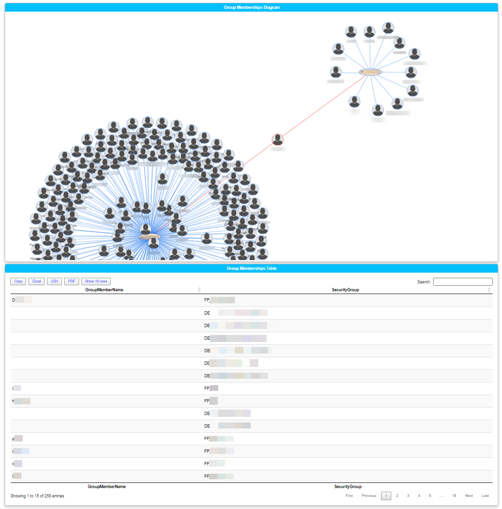

## Invoke-VisualGroupMembership

#### Beta - In progress

The goal of the script was to help visualise which users are members of more than one primary group below an OU level. 
Due to Forcepoint requiring that users are a member of only a single policy that is filtered by Security group, this script should help to validate that users are receiving the expected policy

